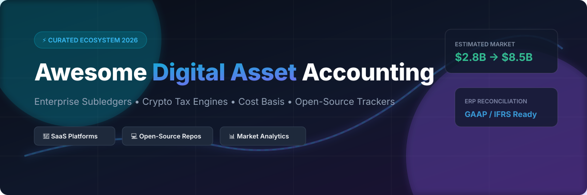

# 📊 Awesome Digital Asset Accounting

  
  
  
  
  
  

## 💼 Top Digital Asset Accounting & Crypto Tax Ecosystem

> **Curated List of SaaS Platforms & Open-Source Projects for Digital Asset Accounting, Crypto Subledgers, Cost Basis Tracking & Web3 Financial Compliance**  
> *Last updated: October 2026*

This repository tracks notable enterprise **SaaS platforms** and **open-source repositories** for **Digital Asset Accounting**. These specialized financial software tools enable enterprises, DAOs, hedge funds, CPAs, and web3 finance teams to reconcile cryptocurrency transactions, compute cost basis (FIFO, LIFO, HIFO, Specific ID), comply with IRS Form 1099-DA / Form 8949 regulations, and seamlessly sync digital asset activity into traditional general ledgers (ERP systems) such as **QuickBooks**, **NetSuite**, **Sage Intacct**, **SAP**, and **Xero**.

---

## 📌 Table of Contents
- [🏢 SaaS & Hosted Platforms](#-saas--hosted-platforms)
- [💻 Open-Source GitHub Projects](#-open-source-github-projects)
- [🛠️ Integration & Frameworks](#️-integration--frameworks)
- [🤝 How to Contribute](#-how-to-contribute)
- [📜 Disclaimer](#-disclaimer)
- [💖 Support & Sponsorship](#-support--sponsorship)
- [📈 Star History](#-star-history)

---

## 🏢 SaaS & Hosted Platforms

📈 **Sector Market Size & Structure**: The global digital asset accounting & crypto tax software market is estimated at **$2.8 Billion in 2026** (projected to reach **$8.5 Billion by 2030** at a CAGR of ~25.4%). The sector is **moderately fragmented**, spanning consumer tax filing apps, specialized DeFi calculators, and institutional subledgers, but is increasingly consolidating around top market-leading unicorns (TaxBit, Lukka, CoinTracker).

Below is a comparative breakdown of commercial enterprise subledgers and digital asset accounting platforms, sorted by **Company Size / Valuation (Descending)**:

| 🏆 Platform | 📝 Focus & Description | 💰 Starting Tier Price | 🎁 Free Tier / Free Trial Limits | 📊 Company Size / Valuation |
| :--- | :--- | :--- | :--- | :--- |
| **[TaxBit](https://taxbit.com/)** | Dominant enterprise crypto tax & accounting infrastructure connecting 500+ exchanges, wallets, and blockchains. Powers tax compliance for PayPal and Gemini. CARF & DAC8 compliant. | **$2,500/year** (Enterprise compliance baseline) | **No Free Tier**; 14-day guided enterprise trial demo upon request | **$1.33 Billion** Valuation ($235M Total Funding) |
| **[Lukka](https://lukka.tech/)** | Institutional crypto data & accounting platform tracking 1.5M+ assets. Powers S&P Dow Jones crypto indices. Holds SOC 1/2 Type 2 & ISO 27001 certifications. | **$3,000/year** (Institutional subledger baseline) | **No Free Tier**; 14-day guided sales demo & sandbox testing | **$1.30 Billion** Valuation ($110M Total Funding) |
| **[CoinTracker](https://www.cointracker.io/)** | Market-leading portfolio tracking & crypto tax filing software for individuals, CPAs, and enterprise institutions. | **$59/year** (Base tax tier starting price) | **Free Plan**: Up to 25 transactions & portfolio tracking forever | **$1.30 Billion** Valuation ($100M+ Total Funding) |
| **[Ledgible](https://ledgible.io/)** | CPA & tax firm crypto subledger integrated with Thomson Reuters ONESOURCE, UltraTax CS, Lacerte, and CCH Axcess for IRS Form 1099-DA reporting. | **$49/year** (Individual/CPA tier starting price) | **30-Day Free Trial** (Full access to CPA portal & tax engine) | **$80.0 Million** Valuation ($20M+ Series A) |
| **[Cryptio](https://cryptio.co/)** | Enterprise crypto accounting subledger with $3T+ transaction volume processed. Features Big Four auditor-approved controls and ERP sync (NetSuite, SAP, Xero, QuickBooks). | **$399/month** (Scale tier starting price) | **14-Day Free Trial** (Enterprise demo & API sandbox upon request) | **$71.2 Million** Funding / ~$15.8M ARR |
| **[Bitwave](https://www.bitwave.io/)** | Enterprise Web3 accounting platform with native multi-entity cost basis calculation (FIFO, LIFO, HIFO) and NetSuite/Sage Intacct integration. Acquired Gilded in 2023. | **$1,500/month** (Enterprise baseline tier) | **14-Day Free Trial** (Guided enterprise onboarding demo) | **$50.0M–$100.0M** Est. Valuation ($22.25M Funding) |
| **[Integral](https://integral.finance/)** | AI-native crypto accounting and treasury management platform for Web3 enterprises and DAOs. | **$299/month** (DAO & business starting price) | **14-Day Free Trial** (Full treasury & subledger access) | **€30.0 Million (~$33.0M)** Total Funding (€18M Series A) |
| **[Entendre Finance](https://www.entendre.finance/)** | AI-powered Web3 accounting automation engine for enterprise digital assets. *(Acquired by MoonPay in June 2026)* | **$499/month** (Enterprise automation baseline) | **14-Day Free Trial** (Self-serve trial available prior to acquisition) | **$4.0 Million** Seed Funding *(Acquired by MoonPay)* |
| **[SoftLedger](https://softledger.com/)** | Cloud-native general ledger with a built-in digital asset module (CryptoSync). Real-time consolidated multi-entity reporting without external subledger dependencies. | **$749/month** (Base GL platform; $1,375/mo for Digital Assets module) | **14-Day Free Trial** (Guided sales demo & sandbox access) | **Seed-Backed** ($1M–$5M Funding / Private ARR) |
| **[Gilded](https://gilded.finance/)** | CPA-built crypto accounting tool rated #1 in QuickBooks App Store. Automated historical spot prices, cost basis, and AP/AR bill pay. *(Sub-brand of Bitwave)* | **$99/month** (QuickBooks subledger plan) | **14-Day Free Trial** (Full QuickBooks sync testing) | **Acquired** by Bitwave in September 2023 |

---

## 💻 Open-Source GitHub Projects

🔓 **Privacy-First & Self-Hosted Open Source**: Self-hosted solutions enable individuals, developers, and privacy-conscious firms to process wallet histories locally without exposing private financial keys or transaction data to third-party cloud servers.

Below are top open-source crypto tax calculators, portfolio trackers, and subledgers, sorted by **GitHub_Stars_Count (Descending)**:

| 🚀 Repository | ⭐️ GitHub_Stars_Badge | ⚡ Description & Core Capabilities |
| :--- | :--- | :--- |
| **[Rotki](https://github.com/rotki/rotki)** |  | The leading open-source portfolio tracking, analytics, accounting, and tax reporting application (AGPL-3.0). Local SQLCipher encrypted database, multi-chain EVM/Bitcoin/Solana support, and DeFi transaction decoding. |
| **[BittyTax](https://github.com/BittyTax/BittyTax)** |  | Comprehensive Python-based cryptocurrency tax calculator supporting major exchanges, wallets, and explorers with automated capital gains calculation. |
| **[RP2](https://github.com/eprbell/rp2)** |  | Privacy-focused multi-country crypto tax calculator computing long/short-term gains, cost bases (FIFO, LIFO, HIFO), and outputting directly in IRS Form 8949 format. |
| **[Crypto Tax Calculator](https://github.com/caxete/crypto-tax-calculator)** |  | Comprehensive open-source tax calculation solution supporting leading wallets, exchanges, and blockchain explorers. |
| **[Cryptofolio](https://github.com/Xtrendence/Cryptofolio)** |  | Open-source web, mobile, and desktop cryptocurrency portfolio tracker featuring a self-hosted RESTful API. |
| **[Cryptowatch](https://github.com/alexanderepstein/cryptowatch)** |  | Lightweight CLI terminal application for tracking real-time cryptocurrency prices and account balances. |
| **[Investments](https://github.com/cdump/investments)** |  | Privacy-focused investment portfolio manager and tax calculator handling multi-asset capital gains using FIFO/LIFO/HIFO rules. |
| **[DaLI (RP2 Data Loader)](https://github.com/eprbell/dali-rp2)** |  | Data Loader Interface plugin framework for RP2 that automates input file generation from exchange REST APIs and CSV exports. |
| **[Coinfox](https://github.com/vinniejames/coinfox)** |  | Desktop crypto coin portfolio manager for tracking Bitcoin, altcoin, and DeFi holdings. |
| **[LlamaFolio API](https://github.com/llamafolio/llamafolio-api)** |  | Open-source, privacy-conscious portfolio tracking API engine created by Llama Corp. |
| **[HODL Totals](https://github.com/Daring-Crypto-Ventures/hodl-totals)** |  | TypeScript-based DIY crypto tax transaction tracker and profit/loss calculator. |
| **[DeFiTaxes](https://github.com/BittyTax/defitaxes)** |  | Web application for calculating cryptocurrency taxes directly from on-chain DeFi smart contract activity. |

---

## 🛠️ Integration & Frameworks

Building custom digital asset accounting infrastructure? Consider combining these foundational tools:

- 🔒 **Privacy & Local Storage**: Deploy **[Rotki](https://github.com/rotki/rotki)** for encrypted, local portfolio tracking without third-party API leaks.
- 🧮 **Tax Engine**: Integrate **[BittyTax](https://github.com/BittyTax/BittyTax)** or **[RP2](https://github.com/eprbell/rp2)** to compute FIFO/LIFO/HIFO capital gains and generate IRS Form 8949 audit files.
- 🔌 **Automated Data Ingestion**: Use **[DaLI](https://github.com/eprbell/dali-rp2)** to standardise raw REST API wallet data into subledger-ready formats.
- ⛓️ **DeFi Analytics**: Leverage **[DeFiTaxes](https://github.com/BittyTax/defitaxes)** for on-chain liquidity pool and yield farming transaction classification.

---

## 🤝 How to Contribute

Contributions are warmly welcome! To add or update an entry:

1. 🍴 **Fork** this repository.
2. 📝 Add/update the relevant entry in `README.md` following the tabular formatting.
3. 🔍 Ensure descriptions are factual, links lead to official sites, and pricing/Stars_Counts are accurate.
4. 🚀 Open a **Pull Request** with a concise summary of changes.

---

## 📜 Disclaimer

- This repository is a **community-curated index** for informational and educational purposes only.
- Digital asset accounting software handles sensitive financial data and must adhere to regional tax laws (IRS, HMRC, ATO, CARF, DAC8), GAAP/IFRS standards, and anti-money laundering (AML) regulatory compliance.
- Always consult a certified CPA or qualified tax attorney before submitting official tax disclosures or financial statements.

---

## 💖 Support & Sponsorship

Thank you so much for exploring and using **Awesome Digital Asset Accounting**! If this curated resource has helped your web3 finance team, CPA practice, DAO, or accounting platform research:

- ⭐ **Star** this repository on GitHub to help others discover it.
- 🍴 **Fork** and contribute new platforms or open-source tax tools.
- 📢 **Share** this list with fellow crypto accountants, CFOs, and finance developers.
- ☕ **Sponsor / Buy me a coffee**: If you'd like to support the ongoing maintenance of this awesome list, visit the [GitHub Sponsor Dashboard](https://github.com/sponsors/ishandutta2007).

  

---

## 📈 Star History

---

  <b>Made with ❤️ for Web3 Accountants, Tax Professionals, CFOs & Digital Asset Finance Teams</b>

